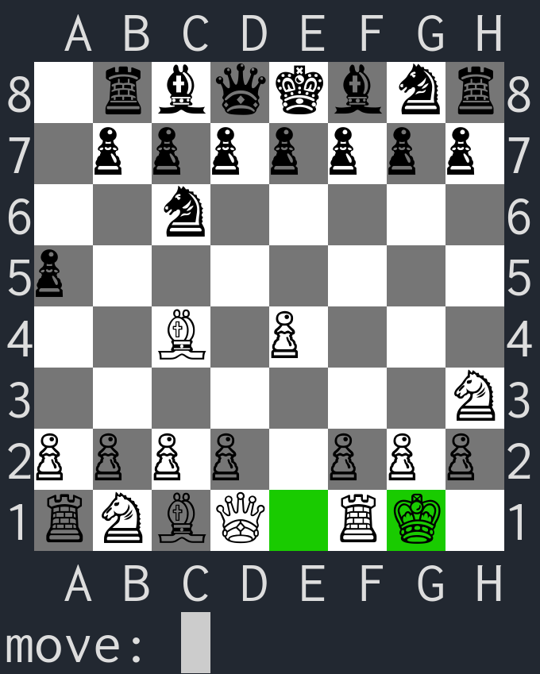

# vchesser
- [x] ui
  - [x] promotion user input
- [x] move gen
  - [x] regular moves
  - [x] check/mate logic
  - [x] castling
  - [ ] pawn promotion
  - [ ] ~~en passant~~
- [ ] AI
  - [x] evaluation
    - [x] pieces
	- [x] center
	- [x] moves
	- [x] checkmate
	- [ ] unsafe pieces
  - [x] minimax search
  - [ ] alfa beta pruning
  - [ ] moves sort

